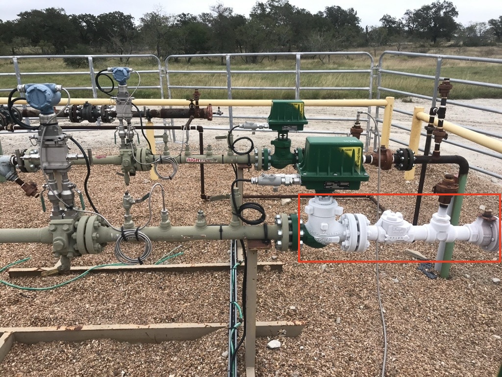

# EOG Resources - HackUTD: RippleEffect

# Hydrate Detection Challenge

## Challenge Statement
Imagine you are a lease operator at EOG, tasked with ensuring optimal production from a group of wells. One of the challenges you face is the formation of hydrates (ice-like solids made of frozen natural gas) that can form inside pipelines and block the injection of gas. This blockage can significantly reduce oil production and potentially lead to costly well shutdowns.
 
As a lease operator, your goal is to efficiently monitor these wells and quickly identify any instances of hydrate formation. You have access to data streams that include the current gas injection volume, target gas injection volume, and valve open percentage. Your challenge is to develop a solution that makes it easy and quick to detect when a hydrate occurs, allowing the lease operator to take swift action to minimize production loss. 
 
**Extension:** With an additional day of data, enhance your solution by predicting when a hydrate is likely to form.

A prize will be awarded to the 2 best teams for this category, please come and see the EOG Resources team for more details.

Access the project GitHub with this QR code:

    

## Additional Information
- What does a hydrate actually look like?
    

           
    

- How does a hydrate form and why does it cause production loss?
    - Oil wells produce more oil when gas is injected into them. High-pressure gas is delivered to a well from a compressor station via a pipeline. This pipeline is underground for the most part but rises above ground before it reaches a well to allow for maintenance when needed. However, sometimes the change in temperature and pressure that occurs at the riser can cause a hydrate to form. The formation of hydrates is not a desirable phenomenon as it blocks gas from being injected into the well, which in turn decreases oil production and could potentially cause the well to be shut in, costing the company millions of dollars.

            ---------------=-----========---------------------=--------
                        |         Valve     ICEPLUG
            ---------------=-----========------------------------------

- TODO: Definition of what each of the streams mean

- TODO: How does the valve work?

- TODO: What can a solution look like?

## Workshop: Introduction to Mobile Development
**Check out our workshop at 3:30 PM in ECSW 1.315**
Join EOG for an iOS development workshop at HackUTD where we'll explore the fundamentals of Swift and SwiftUI! Whether you're a beginner or looking to refine your skills, you'll learn how to kickstart a new project, navigate the development environment, and create engaging user interfaces. Get ready to unleash your creativity and start building your own iOS apps!
 